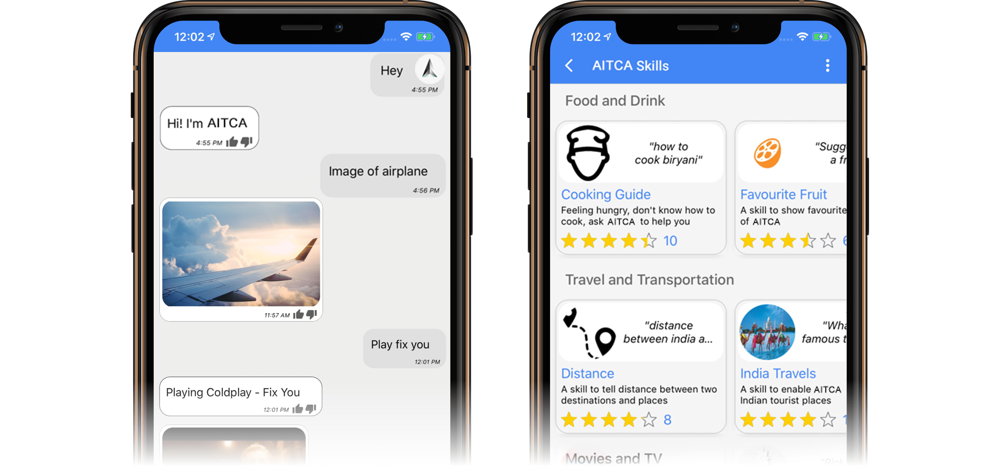
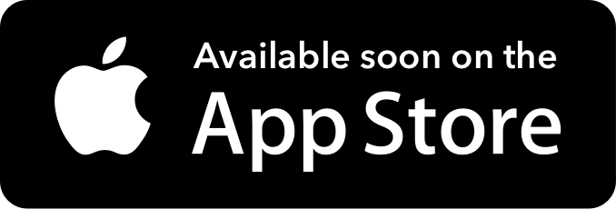
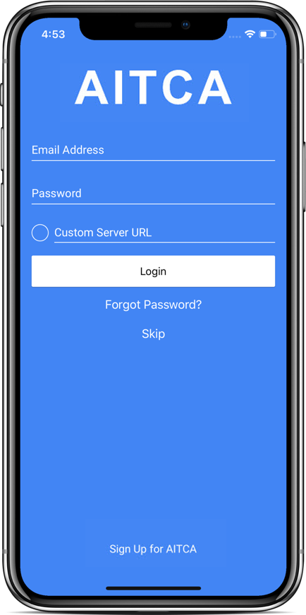
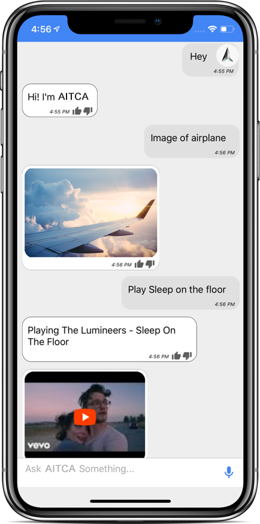
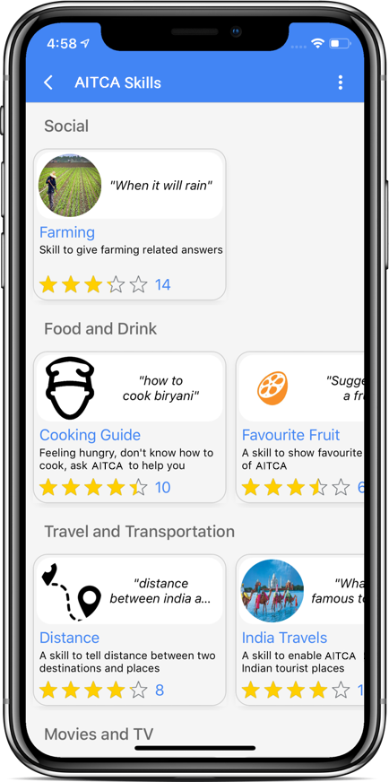
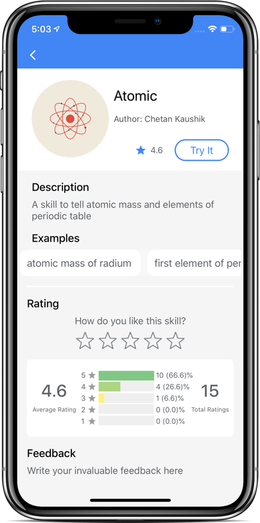
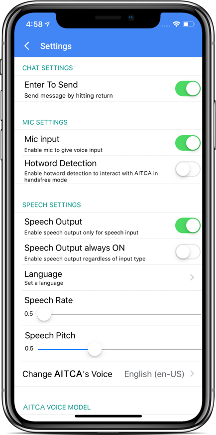
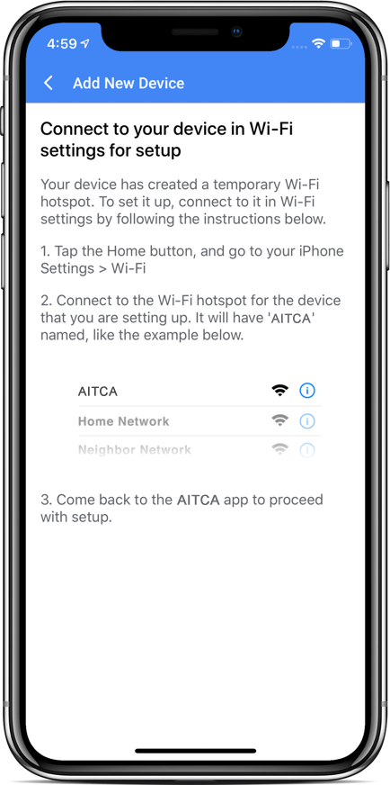

<p align="center"></p>

<p align="center" style="color: gray;">
Meet AITCA, Your Artificial Intelligence for Personal Assistants,<br> Robots, Help Desks and Chatbots. Ask it questions.<br> Tell it to do things. Always ready to help.
</p>

<br />

<p align="center"></p>

<p align="center">  
  <a href="https://github.com/AITCAChain/AITCA-AI">
  
  </a>
</p>

# iOS App for AITCA

| **CircleCI** | **Code Quality** | **Chat** | **Preview** |
|--------------|------------------|----------|-------------|
| [](https://circleci.com/gh/fossasia/susi_iOS) | [](https://www.codacy.com/app/mb/susi_iOS?utm_source=github.com&utm_medium=referral&utm_content=fossasia/susi_iOS&utm_campaign=badger) | [](https://gitter.im/fossasia/susi_iOS?utm_source=badge&utm_medium=badge&utm_campaign=pr-badge&utm_content=badge) | [](https://appetize.io/app/bngee02t60ambqz5ed3kjgfgkm) |

The main feature of the app is to provide a conversational interface to provide intelligent answers using the loklak/AskAITCA infrastructure. The AITCA iOS App make use of the APIs to access information from the hosted server. The app also offers login functionalities to connect to other services and stored personal data. Additionally the application uses data provided by the user's phone to improve AITCA answers. Geolocation information for example helps to offer better answers related to questions about "things nearby". Another main feature of the app is to connect your iPhone/iPad with AITCA Smart Speaker.

## Roadmap

Make the app functionality and UI/UX similar to the [Android app](https://github.com/fossasia/susi_android) for AITCA.

## Development Setup
> __This project is written in Swift 4.2 and Xcode 10 is required for development.__

Before you begin, you should already have the Xcode downloaded and set up correctly. You can find a guide on how to do this here: [Setting up Xcode](https://developer.apple.com/xcode/)

##### &nbsp;&nbsp;&nbsp;&nbsp;&nbsp;&nbsp; Steps to install Cocoapods (one time installation)

- Run `sudo gem install cocoapods` to install the latest version of cocoapods. To install cocoapods from HomeBrew, `brew install cocoapods`.

-  Next, run `pod setup` for setting up cocoapods master repo. You may include `--verbose` for more descriptive logs.
**NOTE:** This might take a while to setup depending on your network speed.

## Setting up the iOS Project

1. Download the _AITCA_iOS_ project source. You can do this either by forking and cloning the repository (recommended if you plan on pushing changes) or by downloading it as a ZIP file and extracting it. OR
```
$ git clone https://github.com/AITCAChain/AITCA-AI
```

2. Navigate to the unzipped folder and run `pod install`.

3. Open `AITCA.xcworkspace` from the folder.

4. Build the project (⌘+B) and check for any errors.

5. Run the app (⌘+R).and test it.

## Screenshots

<table>
  <tr>
    <td></td>
    <td></td>
    <td></td>
  </tr>
  <tr>
    <td></td>
    <td></td>
    <td></td>
  </tr>
</table>

## Branch Policy

**Note:** For the initialization period all commits go directly to the master branch. In the next stages we follow the branch policy as below:

We have the following branches
* **ipa**
All the automatic builds generates, i.e., the ipas go into this branch
* **master**
This contains shipped code. After significant features/bugfixes are accumulated on development, we make a version update, and make a release.
* **development**
All development goes on in this branch. If you're making a contribution,
you are supposed to make a pull request to _development_.


## Code practices

Please help us follow the best practice to make it easy for the reviewer as well as the contributor. We want to focus on the code quality more than on managing pull request ethics. 

* Single commit per pull request
* For writing commit messages please read the [COMMITSTYLE](docs/commitStyle.md) carefully. Kindly adhere to the guidelines.
* Follow uniform design practices. The design language must be consistent throughout the app.
* The pull request will not get merged until and unless the commits are squashed. In case there are multiple commits on the PR, the commit author needs to squash them and not the maintainers cherrypicking and merging squashes.
* If the PR is related to any front end change, please attach relevant screenshots in the pull request description.
* Please follow the guides and code standards: [Swift Style Guide](https://google.github.io/swift/)
* Please follow the good iOS development practices: [iOS Good Practices](https://github.com/futurice/ios-good-practices)
* For contributors new to Git please have a look at the [Git Configuration commands](docs/gitconfiguration.md) .

## License

This project is currently licensed under the Apache License Version 2.0. A copy of [LICENSE.md](https://github.com/AITCAChain/AITCA-AI/blob/master/LICENSE) should be present along with the source code. To obtain the software under a different license, please contact FOSSASIA.


